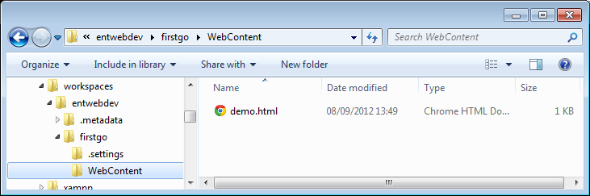
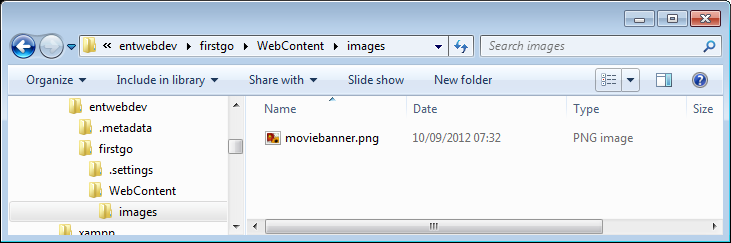
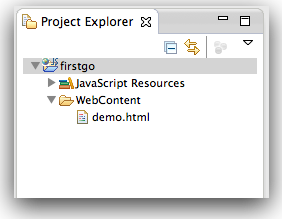
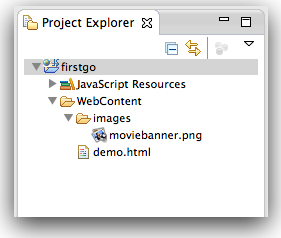
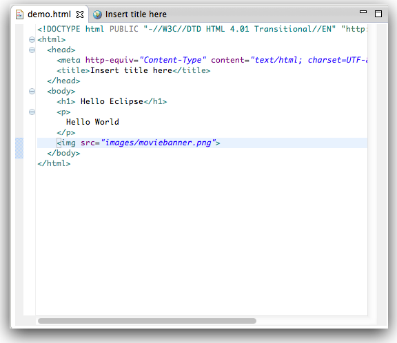

#Project Files

It is worth becoming familiar with the location of the html file you have just generated. Depending on which drive you selected, run "Windows Explorer" (Programs->Accessories->Windows Explorer), navigate to that drive, and open the "workspace" folder.

You should see a folder for the project you just created, along with the html file itself:

Lets do an experiment. Still using Windows Explorer, create a new folder called "images" in the "WebContent"  folder.Now copy an image in here from somewhere else. You could use this image here:

(right click, and save the image).

Now lets switch back to Eclipse looking in particular at the "Project Explorer" on the left:

This is a view of the project however it does not seem to include the new images content we have just added in windows explorer. This is just because the change made has not percolated through to eclipse yet. To correct this, select the project and then select "File->refresh"

Eclipse should now have revealed your image content. Insert a link to this image somewhere in your html file:

You might notice that eclipse may show you errors in the html if your html is incorrect. Save the changes, and switch tabs to the browser view. It will currently display the content without the image. However, if you press the "reload" button (two arrows along the top), then it should display the new version with the image:

