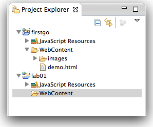
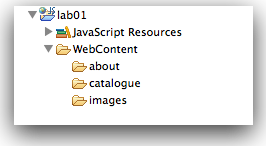
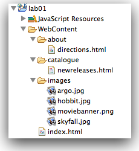
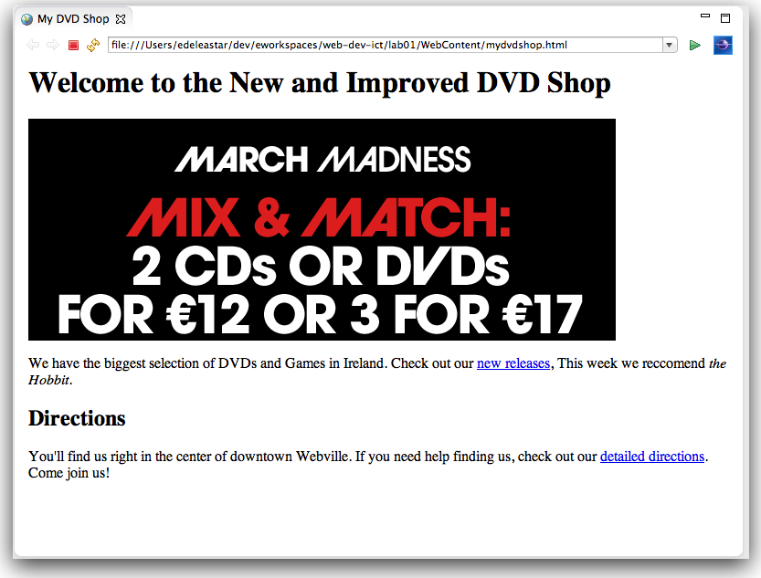

#Lab01 Project

Create a new project called "lab01" using the same options as in the first step of this lab.

Notice that we now have two separate projects open. We will populate lab01 with some simple content to illustrate the basic html vocabulary we have been exploring. First, create come folders inside the lab01 project as shown - to be called "about", "catalogue" and "images":

Here are four image files:

Save these files (right-click in browser and select 'save as') onto your local file system. Then, using explorer, drag and drop them into the 'images' folder. In the dialog Eclipse pops up select the default ('copy') as opposed to 'link'.

Here is some basic html content:

##1: index.html

~~~html
<html>
  <head>
    <title>My DVD Shop</title>
  </head>
  <body>
    <h1>Welcome to the New and Improved DVD Shop</h1>
    
    

      We have the biggest selection of DVDs and Games in Ireland.
      Check out our <a href="catalogue/newreleases.html">new releases</a>,
      This week we recommend <em>the Crazies</em>.  
    

    <h2>Directions</h2>
    

      You'll find us right in the center
      of downtown Webville. If you need help finding
      us, check out our
      <a href="about/directions.html">detailed directions</a>.
      Come join us
    

  </body>
</html>
~~~

##2: newreleases.html

~~~html
<html>
  <head>
    <title> My DVD Shop: New Releases </title>
  </head>
  <body>
    <h2>The Hobbit </h2>
    

      
      he first in a trilogy of films based on the enduring masterpiece The Hobbit by J.R.R. Tolkien,
      The Hobbit: An Unexpected Journey follows title character Bilbo Baggins,
      who along with the Wizard Gandalf and 13 Dwarves, led by Thorin Oakenshield is
      swept into an epic quest to reclaim the lost Dwarf Kingdom of Erebor from the fearsome
      Dragon Smaug.
    

    <h2>Argo</h2>  
    

      
      Based on real events, the dramatic thriller "Argo" chronicles the life-or-death covert operation
      to rescue six Americans, which unfolded behind the scenes of the Iran hostage crisis,
      focusing on the little-known role that the CIA and Hollywood played-information that was not
      declassified until many years after the event.
    

    <h2>Skyfall</h2>
    

      
      Bond's loyalty to M is tested as her past comes back to haunt her. As MI6 comes under attack,
      007 must track down and destroy the threat, no matter how personal the cost.
    

    

      <a href="../index.html">Back to the Shop</a>
    

  </body>
</html>
~~~

##3:directions.html

~~~html
<html>
  <head>
    <title>My DVD Shop Directions</title>
  </head>
  <body>
    <h1>Directions</h1>
    
Take the 305 S exit to Webville go 0.4 mi

    
Continue on 305 go 12 mi

    
Turn right at Structure Ave N go 0.6 mi

    
Turn right and head toward Structure Ave N go 0.0 mi

    
Turn right at Structure Ave N go 0.7 mi

    
Continue on Structure Ave S go 0.2 mi

    
Turn right at SW Presentation Way go 0.0 mi

    

      <a href="../index.html">Back to the Shop</a>
    

  </body>
</html>
~~~

Create new html files in your project using the above content, structured as shown here:

In eclipse, you should be able to browse to the simple web site:

Verify that the links work as expected.
