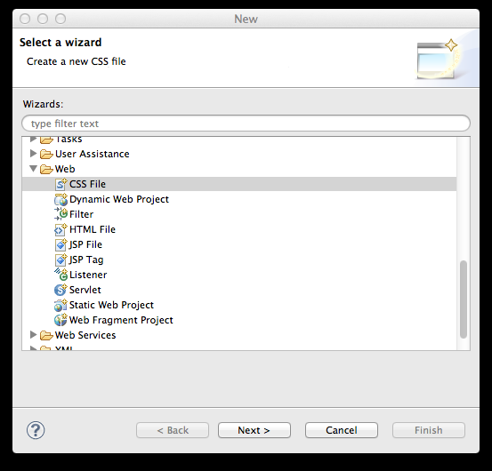
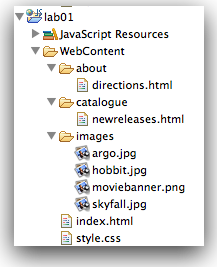

#CSS

We will now introduce a stylesheet into our project. Stylesheets are usually maintained in separate files with the .css extension. Create one now in the lab01 project:

Call it 'style.css'. The workspace should look like this:

We bind this file into the project by 'linking' it to our home page. This must be incorporated into the \<head\> element of each page. Currently index.html head section looks like this:

~~~html
  <head>
    <title>My DVD Shop</title>
  </head>
~~~

We can extend it with a new element to link to the stylesheet:

~~~html
  <head>
    <title>My DVD Shop</title>
    <link type="text/css" rel="stylesheet" href="style.css" media="screen" />
  </head>
~~~

There is no visible effect on our page yet until we introduce a rule into the stylesheet.

Try this one:

~~~css
p
{
  color: maroon;
}
~~~

Staying in Eclipse, you should be able to reload the page in the internal browser, and observe the change in the colour of the text:

Experiment with the following rules, introducing them one at a time:

~~~css
body
{
  font-family:sans-serif;
}
~~~

~~~css
h1, h2
{
  color: gray
}
~~~

~~~css
h1
{
  border-bottom: 1px solid black;
}
~~~
