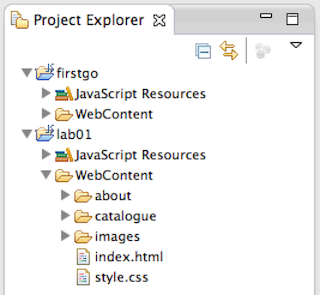
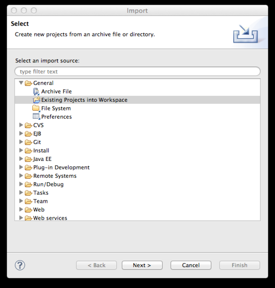
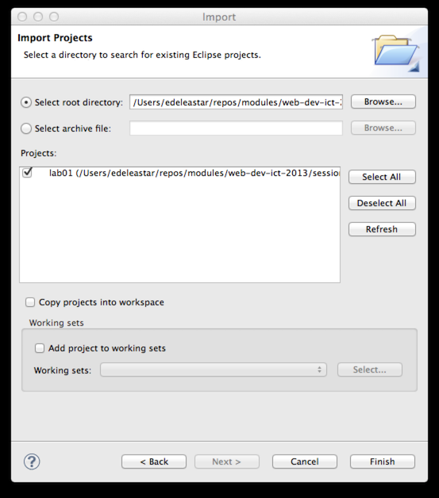
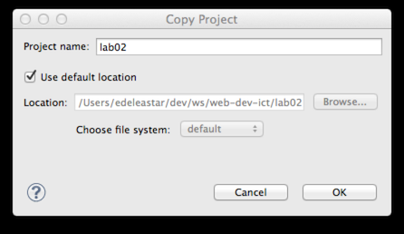
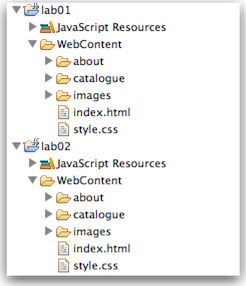

#Setup

##Projects from Lab01

You may have a projects in eclipse called 'fitstgo' and 'lab01' from last week:

However, if you did not save these projects, here are two project archives here of the completed labs:

- [firstgo.zip](./archives/firstgo.zip)
- [lab01.zip](./archives/lab01.zip)

To open these in eclipse, first extract the archives somewhere on our hard disk. The, in Eclipse, select 'File->Import' menu option, and in the dialog select 'Existing Project into Eclipse'

When you browse to and select the folders to which the project have expanded, you should see this:

Note carefully the 'Copy Project into Workspace' option. If you select this, then the full project will be copied into your 'workspace' folder. If you leave in unchecked, then it will remain in the folder where you unzipped it, but it will be 'linked to' from your workspace.

This can be a confusion distinction until you get used to it. For the moment, perhaps, the best option is to check the option and copy the project into your workspace folder.

Another complication is that the projects cannot be imported into a workspace what already contains projects with the same name. So you did save the projects, you cannot import these version into the same workspace. If that is the case, you can create a new workspace (File->Switch Workspace) and import these projects there.

##Project for Lab02

For some of the labs, we would like to build on a foundation established from the previous weeks work. However, we might find it useful to keep the project separate, so the earlier labs are preserved as we left them (in case we wish to revert to them). Normally this would be the task of a revision control system such as git or subversion. For the moment we will just duplicate the projects

This can be easily accomplished in eclipse. Select the lab01 project, and select 'Edit->Copy'. Then select 'Edit->Paste' - which will suggest a default name/location:

Change the name to lab02 as shown and press ok. The end result might look like this in eclipse:

For the remainder of this lab, you can work in this new project.

Before starting, see if you can locate the actual project files in Explorer/Finder. See if you can open the index.html file using Chrome or some other browser.
