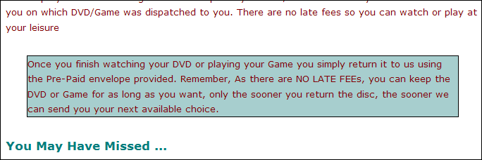
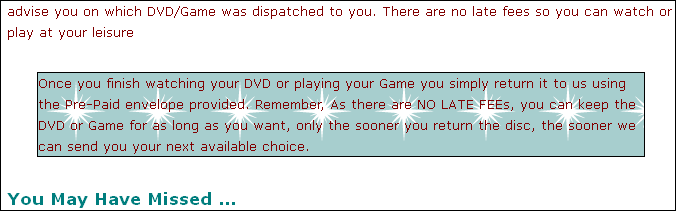
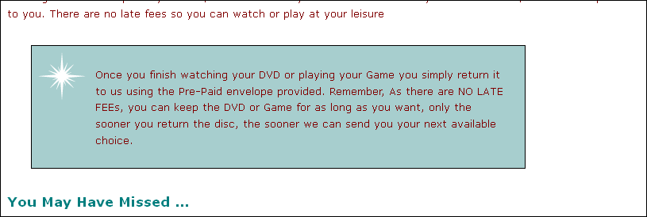
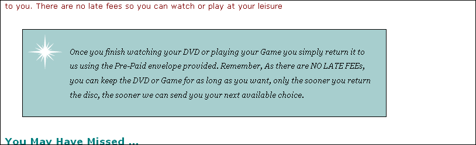
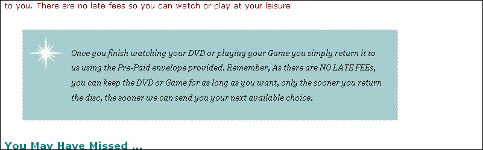

#Returns Paragraph

Locate the 'returns' paragraph in the home page (the third paragraph):

~~~html
  

    Once you finish watching your DVD or playing your Game you simply return it to us
    using the Pre-Paid envelope provided.
    Remember, As there are NO LATE FEEs, you can keep the DVD or Game for as long as you want,
    only the sooner you return the disc, the sooner we can send you your next available choice.
  

~~~

We would like to target this specific paragraph with some custom styles. To this end, we nominate it to a 'class' called 'returns':

~~~html
  

    Once you finish watching your DVD or playing your Game you simply return it to us
    using the Pre-Paid envelope provided.
    Remember, As there are NO LATE FEEs, you can keep the DVD or Game for as long as you want,
    only the sooner you return the disc, the sooner we can send you your next available choice.
  

~~~

In our stylesheet, we can devise a rule just for this paragraph:

~~~css
.returns
{
  border-color: black;
  border-width: 1px;
  border-style: solid;
  background-color: #a7cece;
}
~~~

Reload and review the paragraph:

We can see evidence of our targeted styles.

We can add a little margin:

~~~css
.returns
{
  /* as before */
  margin: 30px;
}
~~~

Reload the page:

Next, the background image. Save this image here to your images folder:

...and we can extend the returns rule with this property here:

~~~css
  background-image: url(images/background.gif) ;
~~~

This seems to yield a repeated pattern:

Some further refinements can put a single image in the top right:

~~~css
  background-repeat: no-repeat;
  background-position: top-left;
~~~

Reloading again:

And we can also further refine the padding:

~~~css
  padding: 25px;
  padding-left: 80px;
  margin-right: 150px;
~~~

Looks like this:

Our full rule for returns now looks like this:

~~~css
.returns
{
  border-color: black;
  border-width: 1px;
  border-style: solid;
  background-color: #a7cece;

  margin: 30px;
  padding: 25px;
  padding-left: 80px;
  margin-right: 150px;

  background-image: url(./images/background.gif);

  background-repeat: no-repeat;
  background-position: top-left;
}
~~~

Some further adjustments to the text itself:

~~~css
  line-height: 1.9em;
  font-style: italic;
  font-family: Georgia, "Times New Roman", Times, serif;
  color: black;
~~~

-

Finally, we might adjust the border itself again:

~~~css
  border-color: white;
  border-width: 1px;
  border-style: dashed;
~~~

Which turns out as:

Regrouping the properties, this is the complete rule:

~~~css
.returns
{
  border-color: white;
  border-width: 1px;
  border-style: dashed;

  margin: 30px;
  padding: 25px;
  padding-left: 80px;
  margin-right: 150px;

  background-color: #a7cece;
  background-image: url(./images/background.gif);
  background-repeat: no-repeat;
  background-position: top-left;

  line-height: 1.9em;
  font-style: italic;
  font-family: Georgia, "Times New Roman", Times, serif;
  color: black;
}
~~~
