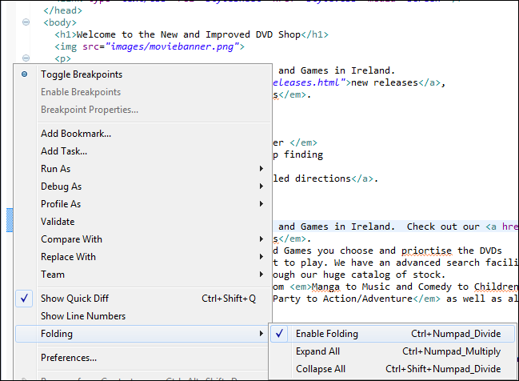
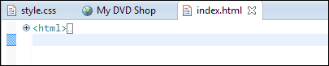
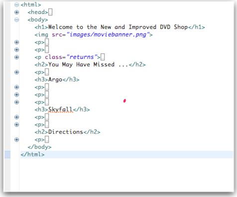
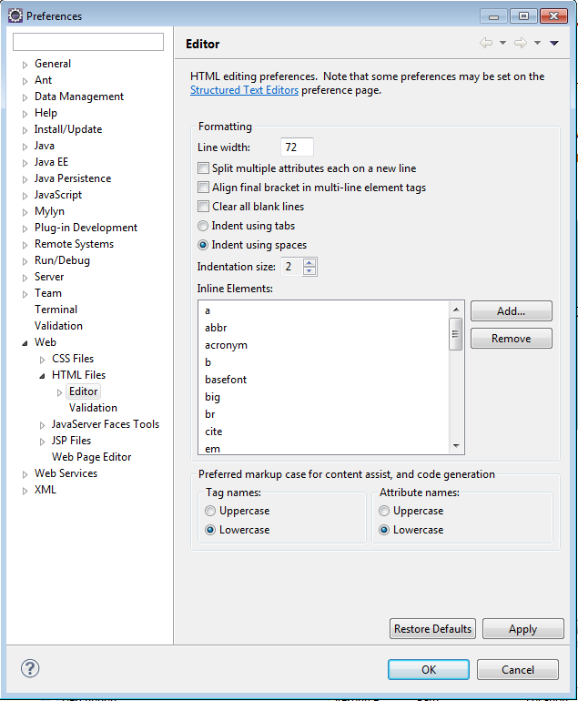
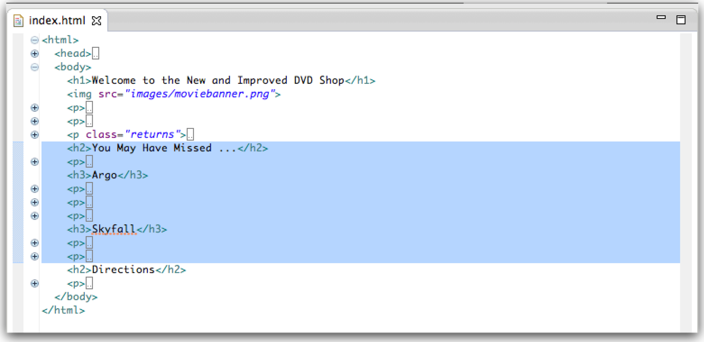
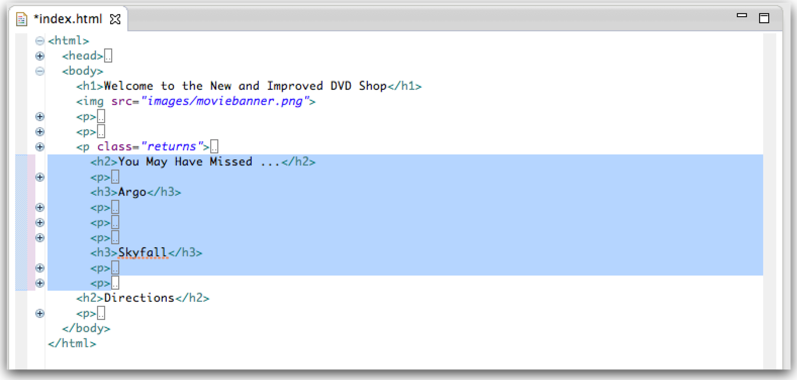
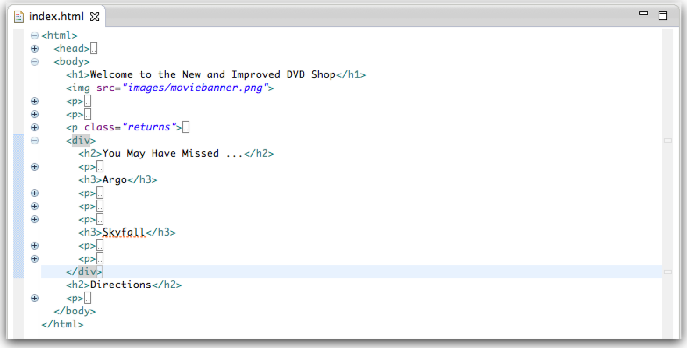

#Configuring Eclipse

Our challenge now is to make adjustments to move and entire set of content into its own 'panel', which we wish to move to the right hand side of our page. Achieving this effect here:

This will involve more significant surgery on the page itself in particular we will need to superimpose a structure on the page, grouping a whole set of elements into a new section.

This section we call a 'Division' facilitated by the `
` tag.

Before we introduce this, however, we should carefully inspect our html and verify that we are laying it out correctly, and in particular that we are obeying consistent indentation rules in the structure of the html itself.

Indentation is simply a consistent placement of spaces before each element, such that it flows in an ordered manner reflecting the opening/closing of tags. We prefer to use 2 spaces for each 'level'.

###Example Inconsistent indentation:

~~~html
    

    We have the biggest selection of DVDs and Games in Ireland.
    Check out our <a href="catalogue/newreleases.html">new releases</a>,
    This week we reccomend <em>the Crazies</em>.  

<h2>Directions</h2>
  
     You'll find us right in the center
      of downtown Webville. If you need help finding
      us, check out our
      <a href="about/directions.html">detailed directions</a>.
      Come join us
 

~~~

###Example Correct indentation

~~~html
    

      We have the biggest selection of DVDs and Games in Ireland.
      Check out our <a href="catalogue/newreleases.html">new releases</a>,
      This week we reccomend <em>the Crazies</em>.  
    

    <h2>Directions</h2>
    

      You'll find us right in the center
      of downtown Webville. If you need help finding
      us, check out our
      <a href="about/directions.html">detailed directions</a>.
      Come join us
    

~~~

Review your index.html file not and ensure that it is correctly indented. One quick way to determine this is to 'fold' all the elements in the editor. To do this, right click in the left hand margin of the html editor and select 'Folding->Collapse All':

This will reduce your editing view to this:

and by selectively expanding elements, you should be able to generate a view like this:

It is likely that your indentation will not look like the above, so take the opportunity now to line up all elements consistently. This can be tedious, and there are tools to do this automatically, but do it manually for the moment.

This mode of editing will allow us to clearly mark a 'division', indent it, and encapsulate it in the `
` tag. Once completed, we can give this division an ID, and target it with a rule to style just this panel appropriately.

Before making this adjustment, however, we need to make one small change to the default Eclipse settings. By default, eclipse uses 'tabs' for indentation. We would like to change this to spaces 2 per indentation level.

Select 'Window->Preferences' and change the setting under 'Web->HTML Files->Editor' as shown here:

This adjustment make the task of introducing our `
` significantly easier, all the time maintaining our correct indentation level.

Now, select the "You may have missed" section:

... and press 'tab' once. This should indent this region by 2 spaces:

Now insert the new `
` element to encapsulate this region:

No give the `
` you have just introduced an id:

~~~html
    

      <h2>You May Have Missed ...</h2>
      ...
~~~

the folding editor is a little temperamental, and can loose structural information easily. So, to restore reliably restore a correct view, close and reopen the editor (making sure to save the file), and you should be able to generate a consistent view.
