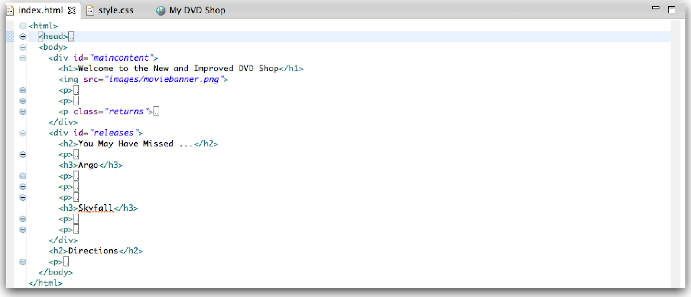

#Sidebar

We can now target this division directly with the following rule in the CSS:

~~~css
#releases
{
  border-width: thin;
  border-style: solid;
  border-color: #007e7e;
}
~~~

This establishes a suitable border (reload to see the effect). Now lets set the width:

~~~css
  width: 15,0px;
~~~

And lets further set the general dimensions:

~~~css
  padding-right: 20px;  
  padding-left: 20px;
  padding-bottom 20px;
~~~

Set a margin:

~~~css
  margin-left: 20px;
~~~

and set the text more apropriately centered:

~~~css
  text-align: center;
~~~

Our full rule is now:

~~~css
#releases
{
  border-width: thin;
  border-style: solid;
  border-color: #007e7e;

  width: 150px;
  padding-right: 20px;  
  padding-left: 20px;
  padding-bottom 20px;
  margin-left: 20px;

  text-align: center;
}
~~~

CSS enable us to shorten the structure somewhat, particularly when setting related properties. So we can replace:

~~~css
  padding-right: 20px;  
  padding-left: 20px;
  padding-bottom 20px;
~~~

with

~~~css
  padding: 0px 20px 30px 10px
~~~

Now add one more property to the same rule:

~~~css
  float: right;
~~~

Reload in browser view. This time something interesting happens the entire panel may 'float' to the right of the browser window:

The actual appearance may vary depending on the browser window size.

Although this is promising, it is not quite what we were expecting. The 'releases' panel has floated left of the 'Directions' area, but is still below the main content of the home page. However, some small adjustments can realign the entire page.

First, we introduce a new division to encapsulate the main content of the home page:

it is called 'maincontent'. Then we introduce a rule in the CSS to target this area:

~~~
#maincontent
{
  float:left;
  width:800px;
}
~~~

Although by no means complete yet with the 'directions' still liable to 'pop-out' unpredictably, it is possible that the page might look like this:

This is the complete stylesheet:

~~~css
body
{
  font-family: Verdana, Helvetica, Arial, sans-serif;
  font-size:small;
  line-height: 1.6em;
}

h1, h2
{
  color: #007e7e;
}

h1
{
  font-size: 150%;
}

h2
{
  font-size: 130%;
}

p
{
 color: maroon;
}

.returns
{
  border-color: white;
  border-width: 1px;
  border-style: dashed;

  margin: 30px;
  padding: 25px;
  padding-left: 80px;
  margin-right: 150px;

  background-color: #a7cece;
  background-image: url(./images/background.gif);
  background-repeat: no-repeat;
  background-position: top-left;

  line-height: 1.9em;
  font-style: italic;
  font-family: Georgia, "Times New Roman", Times, serif;
  color: black;
}

#releases
{
  border-width: thin;
  border-style: solid;
  border-color: #007e7e;

  width: 150px;
  padding: 0px 20px 30px 10px
  margin-left: 20px;

  text-align: center;

  float:right;
}

#maincontent
{
  float:left;
  width:800px;
}
~~~

...and this is the complete index.html:

~~~html
<html>
  <head>
    <title>My DVD Shop</title>
        <link type="text/css" rel="stylesheet" href="style.css" media="screen" />
  </head>
  <body>
    

      <h1>Welcome to the New and Improved DVD Shop</h1>
      
      

        We have the biggest selection of DVDs and Games in Ireland.  
        Check out our <a href="catalogue/newreleases.html">new releases</a>,
        This week we recommend <em>the Crazies</em>.  
        From our extensive catalog of DVDs and Games you choose and priortise the DVDs
        you most want to see or Games you want to play. We have an advanced search facility
        available for our users to search through our huge catalog of stock.
        We stock a wide variety for movies from <em>Manga to Music and Comedy to Childrens,
        Games from Puzzles to Beat'em Up and Party to Action/Adventure</em> as well as all the
        latest new releases.
      

      

        We endeavour to give you your most wanted DVD and/or Game from your rental
        queue depending on our stock situation. All DVDs and Games are posted out at noon
        FIRST CLASS, and should be at your doorstep by the next morning.
        When we dispatch your DVD/Game we'll send you an e-mail to advise you on which
        DVD/Game was dispatched to you. There are no late fees so you can watch or play at your leisure
      

      

      Once you finish watching your DVD or playing your Game you simply return it to us
      using the Pre-Paid envelope provided.
      Remember, As there are NO LATE FEEs, you can keep the DVD or Game for as long as you want,
      only the sooner you return the disc, the sooner we can send you your next available choice.
    

    

    

      <h2>You May Have Missed ...</h2>
      

        
      

      <h3>Argo</h3>  
      

        
      

      

        Based on real events, the dramatic thriller "Argo" chronicles the life-or-death covert operation
        to rescue six Americans, which unfolded behind the scenes of the Iran hostage crisis,
        focusing on the little-known role that the CIA and Hollywood played-information that was not
        declassified until many years after the event.
      

      

        
      

      <h3>Skyfall</h3>
      

        
      

      

      Bond's loyalty to M is tested as her past comes back to haunt her. As MI6 comes under attack,
      007 must track down and destroy the threat, no matter how personal the cost.
    

    

    <h2>Directions</h2>
    

      You'll find us right in the center
      of downtown Webville. If you need help finding
      us, check out our
      <a href="about/directions.html">detailed directions</a>.
      Come join us
    

  </body>
</html>
~~~
